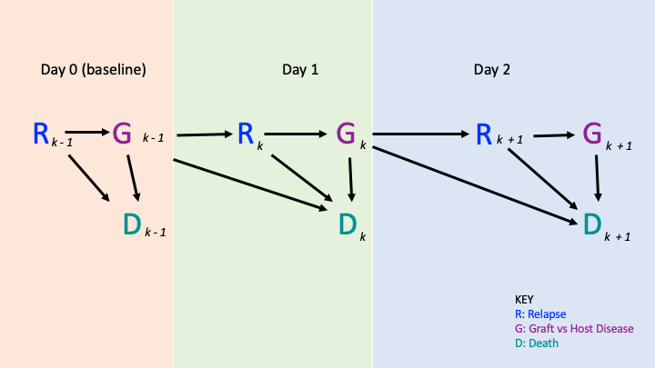

```{r setup, include=FALSE}
knitr::opts_chunk$set(echo = FALSE)
```

## Paper

*The parametric G-formula for time-to-event data: towards intuition with a worked example* - Alexander Keil (2014) University of North Carolina Department of Epidemiology

## Project

- Review paper
  + How effective is it at explaining the g-formula?
- Recreate their example
  + Data already extracted
  + Reimplement SAS code in R
- Additional analyses
  + Try other methods with the same dataset
  + Make some useful general purpose functions

## G-formula
- The parametric g-formula can be used to adjust for time-varying confounders that are affected by prior exposures

## Worked Example: Data

- 137 individuals who received bone marrow transplants at four medical centers
- Followed until death or censoring at 5 years after transplant
- Covariates include age, sex, leukemia type, wait time from diagnosis to transplant, and CMV immune status
- Primary outcomes are mortality and loss to follow-up


## Worked Example: Causal Diagram
```{r echo=FALSE, out.width='100%'}

```

## Worked Example: G-formula algorithm
1. Model conditional probabilites in observed data
2. Generate time-varying exposures, covariates, and outcomes in Monte Carlo sample
3. Estimate effect measure

